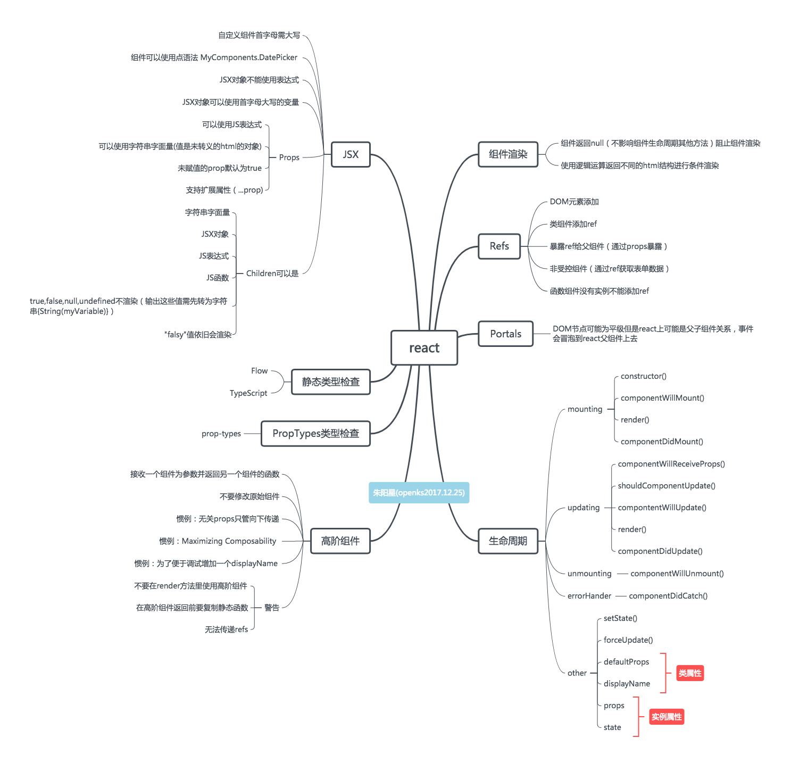

# learn-react

## public文件夹内文件说明

[801_背景颜色和背景图片填充范围](https://openks.github.io/learn-react/public/801-box.html)  
[802_vue生命周期](./802-vue-life-cycle.html)  

前段时间看了 react 的文档并按我自己理解画了如下两张图

添加 react 基础例子 2020 年 9 月 6 日 00:47:02  
添加 react 在单独html文件中使用的例子 2020年10月12日20:24:21  
